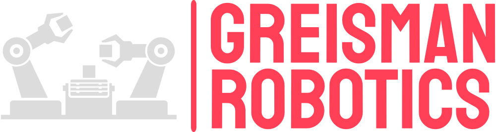

# Welcome to Greisman Robotics!

We are a team of roboticists and developers who build robotic solutions for clients and the open source community. Our goal is to make robots accessible to everyone and solve real-world problems through automation.

## Our Projects

Here are some of our open source projects that you can check out:

- [Robotics Toolbox](https://github.com/greisman/robotics-toolbox) - A collection of tools and algorithms for robotic applications
- [Autonomous Car](https://github.com/greisman/autonomous-car) - A self-driving car platform using ROS and machine learning
- [Robotic Arm](https://github.com/greisman/robotic-arm) - A 3D-printed robotic arm with inverse kinematics and control

## Contact Us

If you're interested in working with us or contributing to our projects, please reach out to us at info@greismanrobotics.com or follow us on [Twitter](https://twitter.com/greismanrobotic) and [LinkedIn](https://www.linkedin.com/company/greismanrobotics/).

